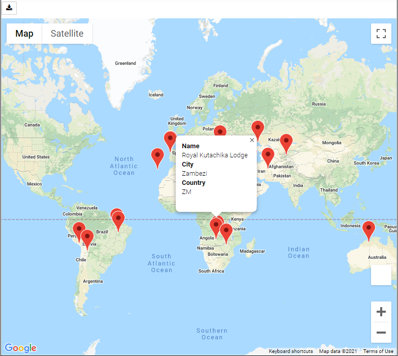

# **What's the Weather Like?**

The idea is to find the ideal vacation location with the best weather.
In this assignment, the objective is to build a series of charts to analayze the correlation between the temperature and other factors:
* Scatter plots,
* Linea Regression lines,
* Heatmap.

  

  

## **1. Authors**

This project was created and authored by:
* **Latyr Thiao**

## **2. Requirements / Specifications**

The [business & technical requirements](000-Instructions) that must be met by the solution.

## **3. Prerequisites**

The mandatory steps to be taken to make the code work smoothly.

### **3.1 License & Key**

The following keys will be required:
* Google API key [Sign up here](https://www.youtube.com/watch?v=367oxHpnn_4)
* Weather API Key [Sign up here](https://home.openweathermap.org/users/sign_in)

### **3.2 Installing**

The assumption here is that your computer is running on Windows 10.
Feel free to adjust if you are using a Mac OS or any other operating system.

What software do you need and how to install them?

* Python
* Anaconda
* Jupyter Notebook

In case, the code does not run in your Jupiter Notebook, try to install the missing modules via the anaconda terminal by doing 'Pip install missing_module. 
Example: pip install gmaps

Make sure you have the these modules:
* matplotlib
* numpy
* requests
* gmaps
* os
* json
* pprint
* time
* embed_minimal_html

Enable html for your Jupyter Notebook. 
* Copy/paste the syntax & execute it: jupyter nbextension enable --py --sys-prefix gmaps

## **4. Tools & Coding Languages**

The following tools and coding languages were used:
* Python
* Pandas

## **5. Data Source(s)**

The data used as input is coming from the following sources:
* Part 1: [Weather API (web)](https://openweathermap.org/api)
* Part 2: [Csv file & Output of Part 1](001-Python_Code/001_WeatherPy/002-Output/Weather_Data_DF.csv)

## **6. Run the code**

### **Step 1: The code is located here**
The VBA code is available as follows:
* Part 1: [Weather](001-Python_Code/001_WeatherPy/001_WeatherPy.ipynb)
* Part 2: [Vacations](001-Python_Code/002_VacationPy/002_VacationPy.ipynb)

### **Step 2: Extract all files & run the code**
* Download this entire project from GitHub
* Configure the "config.py" file based on the keys obtained
* Run the script using Jupyter Notebook

## **7. User Acceptance Testing**

See related document to learn more about acceptence criteria:  
[See Instructions](000-Instructions/README.md)

## **8. Deployment**

Not applicable

## **9. Expected result**

The outcome should be similar to the below:

### Southern Hemisphere - Max Temp vs. Latitude Linear Regression

  

 

### Two maps

  

 

  

 
